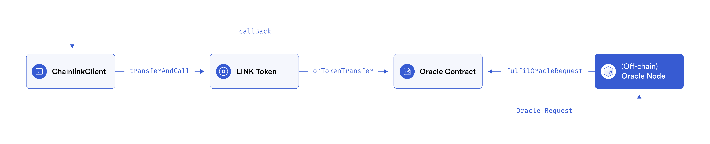
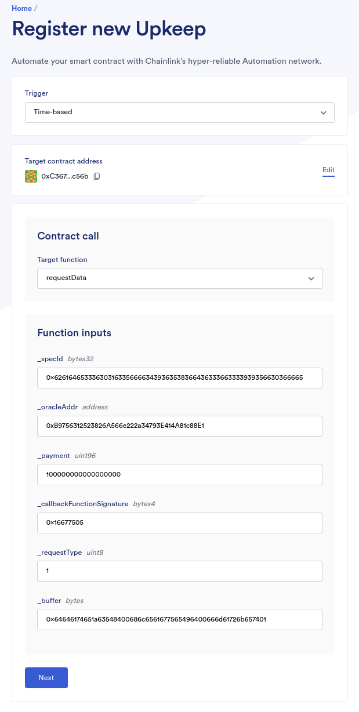
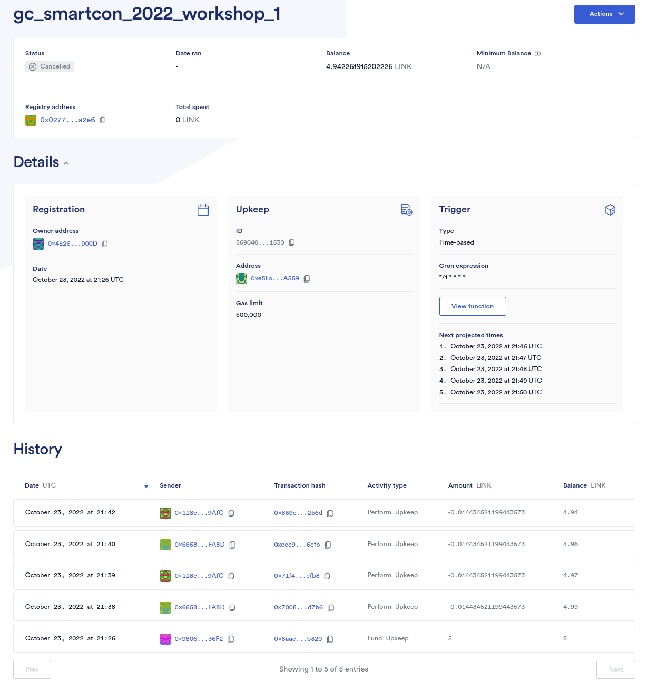

# Direct Request Automation Framework for Testing (DRAFT)

By Víctor Navascués

_This post is adapted from a live workshop at Chainlink SmartCon 2022. The video of this SmartCon workshop is available on LinkPool’s YouTube channel: [Direct Request Automation Framework for Testing (DRAFT) SmartCon Workshop](https://www.youtube.com/watch?v=RA16IIRjFeU)._

Direct Request Automation Framework for Testing (DRAFT) is a framework that we (the LinkPool integrations team) developed to support our Chainlink Direct Request (DR) integrations. This article will discuss how DRAFT can support node operators (NodeOps) and developers on their DR integrations. We'll first introduce what DR integration is and its most common integration lifecycle and pain points. Then, we'll explain the motivation for creating DRAFT at LinkPool and a high level overview of its main components. Finally, we'll walk through a few of its basic uses and few time-based automated strategies for testing jobs. Future articles may cover specific use cases in more detail.

DRAFT is open-source (link below). But, before forking it and giving it a try, be aware of a few specifics:

- The framework was developed on the go to suit LinkPool’s specific needs.
- Usage is focused on on-demand/periodical end-to-end (E2E) DR job testing. It is not a substitute for an integration-specific Consumer contract or an E2E DR job test with the final Consumer contract.
- It has not been audited or fully optimised.

[DRAFT GitHub repository](https://github.com/linkpoolio/draft)

## What is Direct Request?

Direct Request (aka Any API) is a Chainlink product that allows requests of any API & service from a blockchain where the request is triggered by an on-chain event. A high level overview includes the following steps:



1. A NodeOp adds a directrequest Job on its node. A [`directrequest`](https://docs.chain.link/docs/jobs/types/direct-request/) job specification (job spec) is a TOML file that defines, in dot notation, a set of tasks to be executed upon an [`OracleRequest`](https://github.com/smartcontractkit/chainlink/blob/develop/contracts/src/v0.7/Operator.sol#L47) event emitted by the [`Oracle`](https://github.com/smartcontractkit/chainlink/blob/master/contracts/src/v0.6/Oracle.sol) or [`Operator`](https://github.com/smartcontractkit/chainlink/blob/master/contracts/src/v0.7/Operator.sol) contract (aka Oracle). These tasks determine how to request APIs, process their response, and submit the result on-chain. Some API integrations (e.g. request requirements, processing the response, etc.) are too complex for their built-in core tasks (e.g. `http`, `jsonparse`) and an [External Adapter (EA](https://docs.chain.link/docs/external-adapters/) must be used. An EA is an integration-specific server that [bridges](https://docs.chain.link/docs/node-operators/) a job run with an API and provides enhanced request and response processing capabilities. Both jobs and EAs can be implemented by anyone (NodeOp, client, anonymous dev, etc.) but to be used they are required to be available in the Chainlink node first.
2. The NodeOp shares the Job details with the customer who implements the Consumer contract (Consumer) using the [`ChainlinkClient`](https://docs.chain.link/docs/architecture-request-model/#chainlinkclient) library. The main role of the Consumer is to build a [`Chainlink Request`](https://docs.chain.link/docs/any-api/api-reference/#chainlinkrequest), send it, then fulfill it. The request is a Chainlink.Request object that contains the unique job details and the API request parameters (in Solidity) [CBOR encoded](https://github.com/smartcontractkit/chainlink/blob/master/contracts/src/v0.8/vendor/CBORChainlink.sol) (from [Concise Binary Object Representation](https://en.wikipedia.org/wiki/CBOR)).
3. To request the job, the Consumer transfers [LINK](https://github.com/smartcontractkit/LinkToken/blob/master/contracts/v0.4/LinkToken.sol#L27) (via the [`LinkToken.transferAndCall`](https://github.com/smartcontractkit/LinkToken/blob/master/contracts/v0.4/LinkToken.sol#L27) method) to the Oracle and attaches the [`Chainlink.Request`](https://github.com/smartcontractkit/chainlink/blob/master/contracts/src/v0.8/Chainlink.sol#L16) data as payload. The Oracle emits the `OracleRequest` event (including the payload) after receiving the LINK payment.
4. Then, the Chainlink node subscribed to the event triggers a job run. Along with the job execution, the [event data is decoded](https://docs.chain.link/docs/jobs/task-types/eth-abi-decode-log/), the request [parameters are processed](https://docs.chain.link/docs/jobs/task-types/cborparse/) and used to request the APIs (via either [`http`](https://docs.chain.link/docs/jobs/task-types/http/) task or [`bridge`](https://docs.chain.link/docs/jobs/task-types/bridge/) task). Finally, the responses are processed and the result is submitted on-chain back to the Consumer via the Oracle thus fulfilling the request.

Resources:

- [Chainlink docs - Direct Request Jobs (Direct Request from NodeOp point of view)](https://docs.chain.link/docs/jobs/types/direct-request/)
- [Chainlink docs - Any API (Direct Request from Consumer point of view)](https://docs.chain.link/docs/any-api/introduction/)
- [Chainlink docs - Chainlink Arquitecture, Basic Request Model](https://docs.chain.link/docs/architecture-request-model/)
- [LinkPool docs - Lifecycle of a Chainlink Request](https://docs.linkpool.io/docs/general_chainlink_guide)

## Direct Request Integration Life Cycle

The phases of a Direct Request integration life cycle are, in theory, the same as those of the Software Development Life Cycle (SDLC): planning, defining, designing, building, testing, deployment, maintenance. In reality, however, a few of them are grouped and streamlining the process is difficult.

### Designing, building & testing

Validating the data transmission between the Consumer (on-chain) and the Job (off-chain) is the most important step of the process regardless of whether we are creating a new integration or extending an existing one. In both cases it is very common to face unknowns about the type and format of request parameters in the `Chainlink.Request`, how to process them in the job run and/or EA, and the type and format of the response submitted on-chain. Key reasons for questioning and validating the data transmission include:

- Demand for increasingly complex integrations for all kinds of industries, sectors, and Data Providers (DPs). These translate into Chainlink requests with more complex request parameters, results, and scenarios.
- Continuous improvements on the Chainlink framework (e.g. multi-variable responses, new built-in core tasks) which allow for completion of the point above.
- The lack of existing patterns and code to provide inspiration and/or copy. The lack of information available on [StackOverflow](https://stackoverflow.com/), [Ethereum Stack Exchange](https://ethereum.stackexchange.com/), and discord channels proves that we are really pioneering the process of putting real-world data on-chain!

Therefore, it is difficult to separate these 3 phases and, despite the fact TDD & BDD practices already blurred the boundaries of these phases in web2, DR integrations involve frequent E2E job testing. The most common method is:

1. Having the off-chain infrastructure running locally: a Chainlink node with the job(s) and in nearly all circumstances with bridged EA(s) running locally too.
2. A web browser with [Remix](https://remix-project.org/), [Metamask](https://metamask.io/), and an [Etherscan](https://goerli.etherscan.io/)-like explorer to process the on-chain element interact with the Consumer (e.g. deploy, set up, manage funds, verify), and inspect Consumer & Oracle transactions (txs). It is also common to have tabs for multiple online data converters that allows us to convert human-readable data (e.g. text representing ISO8601 date times, names, EVM addresses, UUIDs) into Solidity friendly data types (e.g. uint, bytes). If the Consumer implements the request and fulfillment methods with this logic it will be non-Solidity friendly, non-minimal, opinionated, and consume more gas.
3. Request the Job until a successful request and successful fulfillment validate the data transmission. Otherwise, amend any of the elements (e.g. Consumer, Job, EA(s)), and rinse, lather, repeat. It is worth mentioning that a DR integration may require more than one job and each job may have more than one scenario (i.e. non-deterministic request parameters and/or results).

### Testing, deployment & maintenance

Ideally, every job is tested on each listed network upon deployment, and periodically while in production (different than periodically testing the DP(s) APIs, which is recommended also). Troubleshooting a DR integration may also require an E2E test of a job under specific scenarios if the problem is not on the DP and/or the EA side (both allow for debugging in an isolated fashion).

## Direct Request integrations at scale

Direct Request (along with a Webhook with an External Initiator) is not plug & play. It is the most complex Chainlink service NodeOps provide and DR integrations keep them busy beyond simply providing basic data types.

At LinkPool, the Integrations Team regularly extends existing integrations and builds 1-2 new DR integrations every 2 weeks on average . These jobs are monitored, maintained and periodically tested. At the same time we look out for any Chainlink Direct Request product releases. This work is challenging, time consuming, and very interesting. All in all that's a lot of E2E jobs testing!

### Rationale behind DRAFT design

Given the DR integration life cycle explained above, what if we had:

- A generic Consumer that:
  - Facilitates prototyping the Job spec & Consumer by quickly validating the data transmission between them.
  - Requests any job (unless it has whitelisted consumers) and fulfills any request.
  - Eases the contract management by having a single instance per network (reducing the amount of dust LINK on consumers), and standardises access controls, request/fulfillment methods, fund/withdraw methods, events, etc.
  - Standardises on-demand/scheduled E2E jobs testing, and allows for testing of all jobs listed in [market.link](https://market.link/).
- A framework that:
  - Provides CLI interaction.
  - Allows a request and interprets its results in a human-readable way.
  - Deals with data conversions and repeated inputs across consumers on the network.
  - Eases troubleshooting past DR integrations and its context switching.

## What is DRAFT?

[DRAFT](https://github.com/linkpoolio/draft) is composed of two parts: one on-chain and one off-chain. The core of the on-chain element is the [`GenericConsumer.sol`](https://github.com/linkpoolio/draft/blob/main/contracts/draft/v0.8/GenericConsumer.sol) contract (`GenericConsumer` or GC), while the off-chain part is a set of [Hardhat tasks](https://github.com/linkpoolio/draft/tree/main/tasks/draft/generic-consumer) that interact with the on-chain code.

The main on-chain features are:

- Reduce the contract management per network across the DR integration life cycle. [Request](https://github.com/linkpoolio/draft/blob/main/contracts/draft/v0.8/GenericConsumer.sol#L288) any job on the network (unless the job whitelists consumers) and [fulfill](https://github.com/linkpoolio/draft/blob/main/contracts/draft/v0.8/GenericConsumer.sol#L133) any request with a single contract. This also supports [forwarding the response](https://github.com/linkpoolio/draft/blob/main/contracts/draft/v0.8/GenericConsumer.sol#L309) to an external Consumer (aka [external Chainlink Request](https://github.com/linkpoolio/draft/blob/main/contracts/draft/v0.8/GenericConsumer.sol#L309), where `msg.sender != callbackAddr`).
- Prevent LINK dust amounts across networks and hold [internal LINK balances](https://github.com/linkpoolio/draft/blob/main/contracts/draft/v0.8/GenericConsumer.sol#L42) for consumers. Anyone can [fund](https://github.com/linkpoolio/draft/blob/main/contracts/draft/v0.8/GenericConsumer.sol#L154) any consumer address with LINK and anyone can [withdraw their own funds](https://github.com/linkpoolio/draft/blob/main/contracts/draft/v0.8/GenericConsumer.sol#L426). Note the `GenericConsumer` owner balance is mapped to the `GenericConsumer` address.
- Standardise methods and strategies for scheduled jobs testing. [Chainlink cron jobs](https://docs.chain.link/docs/jobs/types/cron/) and [Time-based Automation](https://docs.chain.link/docs/chainlink-automation/job-scheduler/) can be used for time-based requests by calling any of the two request methods. [Custom Logic Automation](https://docs.chain.link/docs/chainlink-automation/register-upkeep/) can be used for block-based batch testing because `GenericConsumer` is an [Automation Compatible Contract](https://docs.chain.link/docs/chainlink-automation/compatible-contracts/) (implementing [`checkUpkeep`](https://github.com/linkpoolio/draft/blob/main/contracts/draft/v0.8/GenericConsumer.sol#L443) and [`performUpkeep`](https://github.com/linkpoolio/draft/blob/main/contracts/draft/v0.8/GenericConsumer.sol#L190) methods) and is capable of storing jobs request data on its storage.

The main off-chain features are:

- Reduce browser dependency and iterate faster. [Interact via CLI](https://github.com/linkpoolio/draft/blob/main/tasks/draft/generic-consumer/README.md) with `GenericConsumer` contracts. Use [DR-related tools](https://github.com/linkpoolio/draft/blob/main/tasks/tools/README.md), and manage contracts like the [`Operator`](https://github.com/linkpoolio/draft/blob/main/tasks/chainlink/v0.7/operator/README.md), the [`Oracle`](https://github.com/linkpoolio/draft/blob/main/tasks/chainlink/v0.6/oracle/README.md) and a [standard consumer contract](https://github.com/linkpoolio/draft/blob/main/tasks/dev/v0.8/consumer/README.md).
- Reduce usage of data converters. [Request via CLI](https://github.com/linkpoolio/draft/blob/main/tasks/draft/generic-consumer/README.md#request-a-single-jobspec-entry-via-task-arguments) in a more human-readable format (i.e. how the Chainlink node UI shows the job detail) and customise the [CBOR encoding](https://github.com/linkpoolio/draft/blob/main/utils/chainlink.ts#L61) of the request parameters. Also, decode [fulfilled requests](https://github.com/linkpoolio/draft/tree/main/tasks/draft/generic-consumer/decoders) in a human-friendly way. Decoders can be also used on [`Operator` transactions](https://github.com/linkpoolio/draft/blob/main/tasks/chainlink/v0.7/operator/README.md#collect--decode-fulfilled-request).
- Test E2E jobs on-demand faster. Have [actionable in-code job requests](https://github.com/linkpoolio/draft/blob/main/jobs/draft-entries/linkpool-eth-goerli-delta.json) by documenting them per network and node.

Understanding how the generic request and fulfillment methods work in detail not only makes the usage of DRAFT easier but also unlocks its customisation potential.

### A generic request method

An integration-specific consumer contract implies a request method with specific function arguments and CBOR encoding (using their related [`ChainlinkClient` methods](https://docs.chain.link/docs/any-api/api-reference/#methods-2)) used to build the `Chainlink.Request`. For example, [SportsDataIO](https://market.link/nodes/SportsDataIO/integrations) request method:

##### Code snippet: SportsDataIOConsumer.requestSchedule

```solidity
// Can only request a SportsDataIO job
function requestSchedule(
  bytes32 _specId,
  uint256 _payment,
  uint256 _market,
  uint256 _leagueId,
  uint256 _date,
  uint256[] calldata _gameIds
) external {
  Chainlink.Request memory req = buildOperatorRequest(_specId, this.fulfillSchedule.selector);

  req.addUint("market", _market);
  req.addUint("leagueId", _leagueId);
  req.addUint("date", _date);
  _addUintArray(req, "gameIds", _gameIds);

  sendOperatorRequest(req, _payment);
}

```

A generic request method leverages the [`setBuffer`](https://docs.chain.link/docs/any-api/api-reference/#setbuffer) method and allows us to set the CBOR payload directly on the `Chainlink.Request`. To illustrate, this is a simplified version of the [`GenericConsumer.requestData`](https://github.com/linkpoolio/draft/blob/main/contracts/draft/v0.8/GenericConsumer.sol#L288) method:

##### Code snippet: GenericConsumer.requestData

```solidity
// Can request any job without whitelisted requests
function requestData(
  bytes32 _specId,
  address _oracleAddr,
  uint96 _payment,
  bytes4 _callbackFunctionSignature,
  RequestType _requestType,
  bytes calldata _buffer
) external whenNotPaused returns (bytes32) {
  // Validations...
  Chainlink.Request memory req;
  req = req.initialize(_specId, address(this), _callbackFunctionSignature);
  req.setBuffer(_buffer);

  // Send either Chainlink or Operator request...
}

```

The way to accomplish this is by executing the CBOR encoding off-chain and passing it as a `bytes calldata _buffer` parameter. This method offers a number of advantages in the development of a DR integration:

- Fast prototyping and validation of the data transmission on the request. No Consumer contract management after a failed request is needed..
- Makes testing multiple combinations of request parameters easier with no need to use function overloading on DR integrations that have optional request parameters.
- Increased flexibility on the data type and values of the function arguments due to Solidity not checking them.

DRAFT also provides a [tool to CBOR encode off-chain](https://github.com/linkpoolio/draft/blob/main/tasks/tools/chainlink.ts#L41) data using JSON with a specific format (see [`documentation`](https://github.com/linkpoolio/draft/tree/main/tasks/tools#calculate-the-chainlinkrequest-buffer-bytes-from-the-request-parameters)). Try it out with:

##### Code snippet: tool tools:chainlink:buffer (example 1)

```sh
yarn hardhat tools:chainlink:buffer --params '[{ "name": "message", "value": "OK;LG", "type": "string"}]'
```

Request buffer output is: `0x656d6f74746f654f4b3b4c47`

This is a buffer for a SportsDataIO request filtering by `gameIds`:

##### Code snippet: tool tools:chainlink:buffer (example 2)

```sh
yarn hardhat tools:chainlink:buffer \
--params '[
{ "name": "market", "value": "0", "type": "uint" },
{ "name": "leagueId", "value": "0", "type": "uint" },
{ "name": "date", "value": "1663970660", "type": "uint" },
{ "name": "gameIds", "value": [["3903637", "3903638", "3903641"]],
  "type": "bytes", "valueTypes": ["uint256[]"]}
]'
```

Request buffer output is: `0x64646174651a632e2d646767616d6549647358a00000000000000000000000000000000000000000000000000000000000000020000000000000000000000000000000000000000000000000000000000000000300000000000000000000000000000000000000000000000000000000003b909500000000000000000000000000000000000000000000000000000000003b909600000000000000000000000000000000000000000000000000000000003b9099686c6561677565496400666d61726b657400`

It is worth mentioning that:

- By default, this tool deploys on the Hardhat network and uses the [`ToolsChainlinkTestHelper`](https://github.com/linkpoolio/draft/blob/main/contracts/chainlink/v0.8/dev/ToolsChainlinkTestHelper.sol) contract, a slightly modified alternative to the [Chainlink one](https://github.com/smartcontractkit/chainlink/blob/master/contracts/src/v0.8/tests/ChainlinkTestHelper.sol). It is also possible to use this [cbor library](https://www.npmjs.com/package/cbor) but the first method is recommended.
- The request parameters (`--params` items) are sorted alphabetically to preserve determinism along with other advantages.
- Converting and encoding request param types is [fully customisible](https://github.com/linkpoolio/draft/blob/main/utils/chainlink-constants.ts#L36). For instance a new type can convert a ISO8601 date time into a timestamp before finally encoding it as `uint256`.

It is reasonable to think that requesting jobs via CLI is possible after having built a tool for the most complex request method arguments. It only requires previously implementing any other data converter (e.g. `externalJobID` from UUID to `bytes32`) and grouping them under a single hardhat task (see [Request a job via task arguments](https://github.com/linkpoolio/draft/blob/main/tasks/draft/generic-consumer/README.md#request-a-job-via-task-arguments)):

##### Code snippet: task draft:genericconsumer:request (example 1)

```sh
yarn hardhat draft:genericconsumer:request \
--address 0xc5C9DddFC69361C573cE4Aca5f9f4Cc31cd2BE4e \
--action request_data \
--externaljobid bade3601-c5ff-4965-86d6-36c3995f06fe \
--oracleaddr 0xB9756312523826A566e222a34793E414A81c88E1 \
--payment "100000000000000000" \
--callbackfunctionname "sportsdataLpScheduleGamesCreated(bytes32,bytes32[])" \
--requesttype 1 \
--requestparams '[
{ "name": "market", "value": "0", "type": "uint" },
{ "name": "leagueId", "value": "0", "type": "uint" },
{ "name": "date", "value": "1663970660", "type": "uint" },
{ "name": "gameIds", "value": [["3903637", "3903638", "3903641"]],
  "type": "bytes", "valueTypes": ["uint256[]"]}
]' \
--logrequestid \
--mode prod \
--net eth-goerli

```

[Here's the `requestData` tx](https://goerli.etherscan.io/tx/0xb397ef9143b55039b2c8938c819e246d71d0896135f7dd99004fd981fb59fbf3) on ETH Goerli (check the `Input Data`).

### A generic fulfillment method

An integration-specific consumer contract implies a fulfillment method with specific function arguments and a particular function body:

##### Code snippet: SportsDataIOConsumer.fulfillSchedule

```solidity
// Can only fulfill bytes32[]. Results are stored, and can only be decoded as SportsDataIO GameCreateMlb or GameResolveMlb structs
function fulfillSchedule(bytes32 _requestId, bytes32[] memory _result) external recordChainlinkFulfillment(_requestId) {
  requestIdGames[_requestId] = _result;
}

```

The generic fulfillment method leverages a [`fallback` function](https://docs.soliditylang.org/en/v0.8.17/contracts.html#fallback-function), which is executed by the Oracle on every attempt to fulfill a request and the function signature set in the `Chainlink.Request` is not found. The [`GenericConsumer.fallback`](https://github.com/linkpoolio/draft/blob/main/contracts/draft/v0.8/GenericConsumer.sol#L133) function:

##### Code snippet: GenericConsumer.fallback

```solidity
// solhint-disable-next-line no-complex-fallback, payable-fallback
fallback() external whenNotPaused {
  bytes4 callbackFunctionSignature = msg.sig; // bytes4(msg.data);
  bytes calldata data = msg.data;
  _requireFallbackMsgData(data);
  bytes32 requestId = abi.decode(data[4:], (bytes32));
  _requireCallerIsRequestOracle(s_pendingRequests[requestId]);
  delete s_pendingRequests[requestId];
  delete s_requestIdToConsumer[requestId];
  address callbackAddr = s_requestIdToCallbackAddr[requestId];
  if (callbackAddr == NO_CALLBACK_ADDR) {
    emit ChainlinkFulfilled(requestId, true, false, address(this), callbackFunctionSignature, data);
  } else {
    delete s_requestIdToCallbackAddr[requestId];
    // solhint-disable-next-line avoid-low-level-calls
    (bool success, ) = callbackAddr.call(data);
    emit ChainlinkFulfilled(requestId, success, true, callbackAddr, callbackFunctionSignature, data);
  }
}

```

The fallback function processes the msg.data with the same guarantees as [`recordChainlinkFulfillment`](https://docs.chain.link/docs/any-api/api-reference/#recordchainlinkfulfillment) (the standard modifier used by specific-integration consumers) although it offers the following advantages during the development of a DR integration:

- Better fulfillment insights. Emit an extended [`ChainlinkFulfilled`](https://github.com/linkpoolio/draft/blob/main/contracts/draft/v0.8/GenericConsumer.sol#L96) event compared to the genuine [`ChainlinkFulfilled`](https://docs.chain.link/docs/any-api/api-reference/#chainlinkfulfilled). Automatically decode the response in a human-readable way by mapping `callbackFunctionSignature` with decoders.
  - NB: `ChainlinkFulfilled` can not very well include the [`data`](https://github.com/linkpoolio/draft/blob/main/contracts/draft/v0.8/GenericConsumer.sol#L102) argument (it is not indexable and has a dynamic size). All we need to do is obtain it via `tx.data` (lowering the gas cost fulfilling the request).
- Assist development and testing of 3rd party Consumer contracts. Support for `external Chainlink Request`(https://docs.chain.link/docs/any-api/api-reference/#addchainlinkexternalrequest). Forward the response to a Consumer and log whether the fulfillment was successful (make sure the Consumer is `ChainlinkExternalFulfillmentCompatible`(https://github.com/linkpoolio/draft/blob/main/contracts/draft/v0.8/ChainlinkExternalFulfillmentCompatible.sol))

## Basic Usages for DRAFT

In this section we'll showcase how you can use DRAFT for basic use cases on the ETH Goerli network. The requirements are:

1. Clone or fork the [repository](https://github.com/linkpoolio/draft/).
2. Create a .env that sets the `PRIVATE_KEY` (or `MNEMONIC`), and the provider's configuration (e.g. `INFURA_API_KEY`, `ETH_GOERLI_PROVIDER` & `ETH_GOERLI_PROTOCOL` for Infura). Also set credentials of the respective network block explorer (e.g. `ETHERSCAN_API_KEY`).
3. Install the requirements.
4. Get some testnet ETH and LINK. Here’s the [Chainlink faucet](https://faucets.chain.link/).

A [`GenericConsumer` on ETH Goerli](https://goerli.etherscan.io/address/0xc36729e1531da5f94ca51e4bd3525a298919c56b) (at address `0xC36729E1531DA5F94CA51E4BD3525a298919c56b`) is already provided, therefore deploying one is optional (see [Deploy a `GenericConsumer`](https://github.com/linkpoolio/draft/blob/main/tasks/draft/generic-consumer/README.md#deploy-a-genericconsumer)) for more information).

[The deployment tx is here](https://goerli.etherscan.io/tx/0xec1a47ff5b2d9cb36a6ea6d3ee3b51b58c306d5688c70aac0dcc1bd88e92667c).

### 1. Log GenericConsumer detail

Documentation: [Log the storage detail](https://github.com/linkpoolio/draft/blob/main/tasks/draft/generic-consumer/README.md#log-the-storage-detail)

This task logs the current state of a GenericConsumer by reading its storage. The most basic call is:

##### Code snippet: task draft:genericconsumer:log (example 1)

```sh
yarn hardhat draft:genericconsumer:log \
--address 0xC36729E1531DA5F94CA51E4BD3525a298919c56b \
--network eth-goerli
```

Which outputs:

##### Code snippet: task draft:genericconsumer:log (example 1 output)

```sh
INFO (tasks/draft/generic-consumer/tasks.ts): connecting to GenericConsumer at: 0xC36729E1531DA5F94CA51E4BD3525a298919c56b
INFO (tasks/draft/generic-consumer/methods.ts): detail:
    address: "0xC36729E1531DA5F94CA51E4BD3525a298919c56b"
    typeAndVersion: "GenericConsumer 2.0.0"
    description: "SmartCon 2022 Workshop 1"
    owner: "0x4E269e03460719eC89Bb5e3B2610c7ba67BF900D"
    paused: false
    LINK: "0x326C977E6efc84E512bB9C30f76E30c160eD06FB"
    balances: {
      "TOTAL": "2.4 LINK",
      "owner": "2.4 LINK",
      "signer": "0.0 LINK"
    }
    minGasLimitPerformUpkeep: "300000 gas units"
    lots (lot -> isUpkeepAllowed): {}
    latestRoundId: "0"
```

### 2. Fund a consumer address with LINK

Documentation: [Fund a consumer address with LINK](https://github.com/linkpoolio/draft/blob/main/tasks/draft/generic-consumer/README.md#fund-a-consumer-address-with-link)

This task allows you to fund any address with LINK that might later want to request a job. If you were the `GenericConsumer` owner, you'd top-up your balance with 2.4 LINK this way:

##### Code snippet: task draft:genericconsumer:fund (example 1)

```sh
yarn hardhat draft:genericconsumer:fund \
--address 0xC36729E1531DA5F94CA51E4BD3525a298919c56b \
--fundgc \
--amount "2400000000000000000" \
--net eth-goerli \
--mode prod
```

If `0x75A0003E8a8ba51CB42905A976883338E7017B42` was your address, you'd top it up with 0.1 LINK this way:

##### Code snippet: task draft:genericconsumer:fund (example 2)

```sh
yarn hardhat draft:genericconsumer:fund \
--address 0xC36729E1531DA5F94CA51E4BD3525a298919c56b \
--consumer 0x75A0003E8a8ba51CB42905A976883338E7017B42 \
--amount "100000000000000000" \
--net eth-goerli \
--mode prod
```

[Here's the `addFunds` tx](https://goerli.etherscan.io/tx/0x8d78ac16a1d2800f2e761399c892487c12a7148ef3f42a804eb84e03bcd1fc44).

Logging again the detail signed as `0x75A0003E8a8ba51CB42905A976883338E7017B42` shows the 0.1 LINK balance:

##### Code snippet: task draft:genericconsumer:fund (example 2 output)

```sh
INFO (tasks/draft/generic-consumer/tasks.ts): connecting to GenericConsumer at: 0xC36729E1531DA5F94CA51E4BD3525a298919c56b
INFO (tasks/draft/generic-consumer/methods.ts): detail:
    address: "0xC36729E1531DA5F94CA51E4BD3525a298919c56b"
    typeAndVersion: "GenericConsumer 2.0.0"
    description: "SmartCon 2022 Workshop 1"
    owner: "0x4E269e03460719eC89Bb5e3B2610c7ba67BF900D"
    paused: false
    LINK: "0x326C977E6efc84E512bB9C30f76E30c160eD06FB"
    balances: {
      "TOTAL": "2.5 LINK",
      "owner": "2.4 LINK",
      "signer": "0.1 LINK"
    }
    minGasLimitPerformUpkeep: "300000 gas units"
    lots (lot -> isUpkeepAllowed): {}
    latestRoundId: "0"
```

### 3. Request a job via task arguments

Documentation: [Request a job via task arguments](https://github.com/linkpoolio/draft/blob/main/tasks/draft/generic-consumer/README.md#request-a-job-via-task-arguments)

This task allows you to request a job by passing all `GenericConsumer.requestData` or `GenericConsumer.requestDataAndForwardResponse` method arguments.
Let's request all scheduled MLB games on the 23rd of October 2022. We're going to request the [SportsDataIO DR integration (sportsdataio-linkpool EA)](https://market.link/nodes/SportsDataIO/integrations), which has the following details:

- Oracle (address): `0xB9756312523826A566e222a34793E414A81c88E1` (`Operator` contract)
- External Job ID (UUID): `bade3601-c5ff-4965-86d6-36c3995f06fe` (`externalJobID` on the Chainlink node UI)
- Payment (LINK): `100000000000000000` (0.1 LINK)
- Required params:
  - `market`: `0` (games to be created)
  - `leagueId`: ``0` (MLB)
  - `date`: `1666483200` (any UNIX timestamp on the 23rd of October 2022)
- Optional params: `gameIds` (not used)

The command is:

##### Code snippet: task draft:genericconsumer:request (example 2)

```sh
yarn hardhat draft:genericconsumer:request \
--address 0xC36729E1531DA5F94CA51E4BD3525a298919c56b \
--action request_data \
--externaljobid bade3601-c5ff-4965-86d6-36c3995f06fe \
--oracleaddr 0xB9756312523826A566e222a34793E414A81c88E1 \
--payment "100000000000000000" \
--callbackfunctionname "sportsdataLpScheduleGamesCreated(bytes32,bytes32[])" \
--requesttype 1 \
--requestparams '[
{ "name": "market", "value": "0", "type": "uint" },
{ "name": "leagueId", "value": "0", "type": "uint" },
{ "name": "date", "value": "1666483200", "type": "uint" }
]' \
--logrequestid \
--mode prod \
--net eth-goerli
```

Worth mentioning that unless we are doing an External Chainlink Request, the value of `callbackfunctionname` won't matter when it comes to fulfilling the request in the `GenericConsumer`. However, setting its value right does allow DRAFT to map and apply the right decoder.

The command above logs:

##### Code snippet: task draft:genericconsumer:request (example 2 output)

```sh
WARN (tasks/draft/generic-consumer/methods.ts): *** Running REQUEST on PROD mode ***
INFO (utils/deployment.ts): tx overrides
INFO (tasks/draft/generic-consumer/methods.ts): signer address: 0x4E269e03460719eC89Bb5e3B2610c7ba67BF900D
INFO (tasks/draft/generic-consumer/methods.ts): connecting to GenericConsumer at: 0xC36729E1531DA5F94CA51E4BD3525a298919c56b ...
INFO (tasks/draft/generic-consumer/methods.ts): detail:
    address: "0xC36729E1531DA5F94CA51E4BD3525a298919c56b"
    typeAndVersion: "GenericConsumer 2.0.0"
    description: "SmartCon 2022 Workshop 1"
    owner: "0x4E269e03460719eC89Bb5e3B2610c7ba67BF900D"
    paused: false
    LINK: "0x326C977E6efc84E512bB9C30f76E30c160eD06FB"
    balances: {
      "TOTAL": "2.5 LINK",
      "owner": "2.4 LINK",
      "signer": "0.0 LINK"
    }
    minGasLimitPerformUpkeep: "300000 gas units"
    lots (lot -> isUpkeepAllowed): {}
    latestRoundId: "0"
INFO (tasks/draft/generic-consumer/methods.ts): requestData() | Tx hash: 0x98a285a9c5cefff9fc3d4b525a5056f45ca750ce5137edd606a7547ad082f0f4 | Tx block: undefined
    specId: "0x6261646533363031633566663439363538366436333663333939356630366665"
    oracleAddr: "0xB9756312523826A566e222a34793E414A81c88E1"
    payment: "100000000000000000"
    callbackFunctionSignature: "0x6075a63d"
    requestType: "1"
    buffer: "0x64646174651a63548400686c6561677565496400666d61726b657400"
INFO (tasks/draft/generic-consumer/methods.ts): requestData() | receipt block: 7807877 | receipt blockHash: 0xbaf102ce2aaa1fbe77a1469b46f817b851652f837028088f86140e1bb49bd6ad
INFO (tasks/draft/generic-consumer/tasks.ts): requestId in ChainlinkRequested event
    requestId: "0x742fbfbb09fbbc0ab98fbb966b38919a8b5a259ed9d63f6eed92e7cd153fdf36"
INFO (tasks/draft/generic-consumer/tasks.ts): *** Request task finished successfully ***
```

[Check the `requestData` tx here](https://goerli.etherscan.io/tx/0x98a285a9c5cefff9fc3d4b525a5056f45ca750ce5137edd606a7547ad082f0f4).

Among other basic information (e.g. signer, `GenericConsumer` detail, tx hash, etc.), the essential data logged for decoding the fulfillment is:

- All request data in a Solidity-friendly format, like the `callbackfunctonname` converted into a function signature (`0x6075a63d`, as `bytes4`).
- The generated Chainlink Request ID (aka requestID, the [topic of the tx 2nd log](https://goerli.etherscan.io/tx/0x98a285a9c5cefff9fc3d4b525a5056f45ca750ce5137edd606a7547ad082f0f4#eventlog)): `0x742fbfbb09fbbc0ab98fbb966b38919a8b5a259ed9d63f6eed92e7cd153fdf36`.
- The tx block number: `7807877`.

### 4. Request a job from JSON file

Documentation: [Request a job from a JSON entries file](https://github.com/linkpoolio/draft/blob/main/tasks/draft/generic-consumer/README.md#request-a-job-from-a-json-entries-file)

The request arguments used above can be documented as JSON items per node and work as a repository of ready-to-use job requests–a very advantageous outcome for troubleshooting and repetitive testing.

The [JSON entries](https://github.com/linkpoolio/draft/blob/main/jobs/draft-entries/linkpool-eth-goerli-delta.json) file contains all [market.link](https://market.link/) jobs on ETH Goerli. Even more, for some integrations it contains more than one item because for any given job, different request params result in different outcomes (value and/or format) submitted. There are two JSON entries for the SportsDataIO job: [entry 1](https://github.com/linkpoolio/draft/blob/main/jobs/draft-entries/linkpool-eth-goerli-delta.json#L408) and [entry 2](https://github.com/linkpoolio/draft/blob/main/jobs/draft-entries/linkpool-eth-goerli-delta.json#L440).

It makes sense then to create an abstraction that allows us to request an item from this file:

##### Code snippet: task draft:genericconsumer:request-file-entry (example 1)

```sh
yarn hardhat draft:genericconsumer:request-file-entry \
--address 0xC36729E1531DA5F94CA51E4BD3525a298919c56b \
--net eth-kovan \
--filename linkpool-eth-goerli-delta \
--jobid 24 \
--jobcase 0 \
--logrequestid \
--mode prod
```

Bear in mind that depending on the DR integration/DPs API some `requestParams` items may be outdated (especially those related to time events) and may require updating before making the request. For instance, the SportsDataIO request for the schedule of the MLB games requires a datetime in the future (e.g. any day of the next weekend as UNIX timestamp). That logic can also be converted into a custom `requestParams` type.

### 5. Collect & decode a fulfilled request

Documentation: [Collect & decode fulfilled requests](https://github.com/linkpoolio/draft/blob/main/tasks/draft/generic-consumer/README.md#collect--decode-fulfilled-request)

Continuing with the example above of requesting MLB games scheduled on the 23rd of October 2022, let's first better understand the format of the result submitted on-chain. The [sportsdataio-linkpool EA](https://github.com/linkpoolio/adapters/tree/develop/packages/sportsdataio-linkpool) is responsible of submitting an Array of games to be created, each one has to contain: `gameId` (number), `startTime` (ISO8601 date time), `homeTeam` (3-letter acronym) and `awayTeam` (3-letter acronym).

##### Code snippet: a game to be created object

```json
{
  "gameId": 70652,
  "startTime": "2022-10-23T18:37:00.000Z",
  "homeTeam": "PHI",
  "awayTeam": "SD"
}
```

Leveraging [DR Multi Word Response](https://docs.chain.link/docs/any-api/get-request/examples/multi-variable-responses/) and optimising the data types, we can submit the result as `bytes32[]` where each item is a `bytes32` that contains the following data encode packed: `gameId` (as `uint256`), `startTime` (as `uint256`), `homeTeam` (as `bytes10`), and `awayTeam` (as `bytes10`).

##### Code snippet: GameCreateMlb struct

```solidity
struct GameCreateMlb {
  uint32 gameId;
  uint40 startTime;
  bytes10 homeTeam;
  bytes10 awayTeam;
}

```

Below is a simplification of the EA logic that encodes a JSON `GameCreate` item into a `GameCreateMlb` struct, and ends up looking like: `0x00011403006355c914000000000000004e595900000000000000484f55000000`.

##### Code snippet: instantiate and encode GameCreate

```typescript
export function getGameCreate(game: GameByDate): GameCreate {
  return {
    gameId: game.GameID,
    startTime: datetime.iso8061ToTimestamp(`${game.DateTimeUTC}+00:00`),
    homeTeam: `0x${Buffer.from(game.HomeTeam).toString("hex")}`,
    awayTeam: `0x${Buffer.from(game.AwayTeam).toString("hex")}`,
  };
}

const encodedGameCreate = utils.solidityPack(
  marketResultEncode.get(["uint32", "uint40", "bytes10", "bytes10", "bytes3"]) as string[],
  [
    gameCreate.gameId,
    gameCreate.startTime,
    utils.hexZeroPad(gameCreate.homeTeam, 10),
    utils.hexZeroPad(gameCreate.awayTeam, 10),
    utils.hexZeroPad("0x", 3), // NB: zero pad from 29 to 32 bytes
  ],
);
```

And the code below shows how to unpack a `GameCreateMlb` on the Solidity side once fulfilled:

##### Code snippet: unpack GameCreateMlb

```solidity
struct GameCreateMlb {
  uint32 gameId;
  uint40 startTime;
  bytes10 homeTeam;
  bytes10 awayTeam;
}

/* ========== EXTERNAL VIEW FUNCTIONS ========== */

function getGameCreateMlb(bytes32 _requestId, uint256 _idx) external view returns (GameCreateMlb memory) {
  return _getGameCreateMlbStruct(requestIdGames[_requestId][_idx]);
}

function _getGameCreateMlbStruct(bytes32 _data) private pure returns (GameCreateMlb memory) {
  GameCreateMlb memory gameCreateMlb = GameCreateMlb(
    uint32(bytes4(_data)),
    uint40(bytes5(_data << 32)),
    bytes10(_data << 72),
    bytes10(_data << 152)
  );
  return gameCreateMlb;
}

```

[Here is the `fulfillOracleRequest2` tx](https://goerli.etherscan.io/tx/0x9f69a2546735674fee7ecb84aea6991a9173f992701d0dbe31ff9f8a79ace3fe), which has the following `msg.data`:
`0x742fbfbb09fbbc0ab98fbb966b38919a8b5a259ed9d63f6eed92e7cd153fdf3600000000000000000000000000000000000000000000000000000000000000400000000000000000000000000000000000000000000000000000000000000002000113fc00635589cc000000000000005048490000000000000000534400000000011403006355c914000000000000004e595900000000000000484f55000000`.

This task is able to automatically map and decode `msg.data` by [creating the specific decoder](https://github.com/linkpoolio/draft/blob/main/tasks/draft/generic-consumer/decoders/sportsdataio-linkpool.ts#L5) and [registering it](https://github.com/linkpoolio/draft/blob/main/tasks/draft/generic-consumer/decoders/sportsdataio-linkpool.ts#L38) under a deterministic `callbackFunctionName` (i.e. `sportsdataLpScheduleGamesCreated(bytes32,bytes32[])`).

This is how we can query and decode the fulfilled request. Filtering by `requestId` and block number yields:

##### Code snippet: task draft:genericconsumer:collect (example 1)

```sh
yarn hardhat draft:genericconsumer:collect \
--address 0xC36729E1531DA5F94CA51E4BD3525a298919c56b \
--from "7807877" \
--flrequestids '["0x742fbfbb09fbbc0ab98fbb966b38919a8b5a259ed9d63f6eed92e7cd153fdf36"]' \
--network eth-goerli

```

Which not only logs the `ChainlinkFulfilled` event arguments, but also the result decoded in a human-readable way:

##### Code snippet: task draft:genericconsumer:collect (example 1 output)

```sh
INFO (tasks/draft/generic-consumer/tasks.ts): connecting to GenericConsumer at: 0xC36729E1531DA5F94CA51E4BD3525a298919c56b
INFO (tasks/draft/generic-consumer/tasks.ts):
    tx: {
      "hash": "0x9f69a2546735674fee7ecb84aea6991a9173f992701d0dbe31ff9f8a79ace3fe",
      "block": 7807881,
      "timestamp": "1666349004 (2022-10-21T10:43:24.000Z)",
      "from": "0x7b962f2E97cb95794267e256d25a4D000470a1E0",
      "to": "0xB9756312523826A566e222a34793E414A81c88E1",
      "data": "0x6075a63d742fbfbb09fbbc0ab98fbb966b38919a8b5a259ed9d63f6eed92e7cd153fdf3600000000000000000000000000000000000000000000000000000000000000400000000000000000000000000000000000000000000000000000000000000002000113fc00635589cc000000000000005048490000000000000000534400000000011403006355c914000000000000004e595900000000000000484f55000000"
    }
    requestId: "0x742fbfbb09fbbc0ab98fbb966b38919a8b5a259ed9d63f6eed92e7cd153fdf36"
    success: true
    isForwarded: false
    callbackAddr: "0xC36729E1531DA5F94CA51E4BD3525a298919c56b"
    callbackFunctionSignature: "0x6075a63d"
    data: "0x6075a63d742fbfbb09fbbc0ab98fbb966b38919a8b5a259ed9d63f6eed92e7cd153fdf3600000000000000000000000000000000000000000000000000000000000000400000000000000000000000000000000000000000000000000000000000000002000113fc00635589cc000000000000005048490000000000000000534400000000011403006355c914000000000000004e595900000000000000484f55000000"
    dataDecoded: {
      "callbackFunctionName": "sportsdataLpScheduleGamesCreated(bytes32,bytes32[])",
      "result": [
        [
          70652,
          "1666550220 (2022-10-23T18:37:00.000Z)",
          "0x00000000000000504849 (PHI)",
          "0x00000000000000005344000000 (SD)"
        ],
        [
          70659,
          "1666566420 (2022-10-23T23:07:00.000Z)",
          "0x000000000000004e5959 (NYY)",
          "0x00000000000000484f55000000 (HOU)"
        ]
      ]
    }
INFO (tasks/draft/generic-consumer/tasks.ts): number of ChainlinkFulfilled events found: 1
```

This is a result we can definitely understand and it matches the [MLB official schedule for October 23rd 2022](https://www.mlb.com/schedule/2022-10-23) (don’t forget SportDataIO timestamps are in UTC). Moreover, we have not bloated the Consumer implementation or been limited by data structures that hide values, the explorer UI/UX, or other elements.

We can also query & decode using the [Collect & decode fulfiller requests `Operator` task](https://github.com/linkpoolio/draft/blob/main/tasks/chainlink/v0.7/operator/README.md#collect--decode-fulfilled-request). Although, the lack of an event with an argument to map to a decoder will force us to set a specific decoder(s) on the call:

##### Code snippet: task operator:v0.7:collect (example 1)

```sh
yarn hardhat operator:v0.7:collect \
--address 0xB9756312523826A566e222a34793E414A81c88E1 \
--from "7807877" \
--flrequestids '["0x742fbfbb09fbbc0ab98fbb966b38919a8b5a259ed9d63f6eed92e7cd153fdf36"]' \
--decodersigs '["0x6075a63d"]' \
--network eth-goerli
```

### 6. Withdraw the funds

Documentation: [Withdraw LINK from a consumer address](https://github.com/linkpoolio/draft/blob/main/tasks/draft/generic-consumer/README.md#withdraw-link-from-a-consumer-address)

This task allows the withdrawal of either all or part of the LINK balance.

Let's withdraw 0.5 LINK from `0x4E269e03460719eC89Bb5e3B2610c7ba67BF900D` back to itself:

##### Code snippet: task draft:genericconsumer:withdraw (example 1)

```sh
yarn hardhat draft:genericconsumer:withdraw \
--address 0xC36729E1531DA5F94CA51E4BD3525a298919c56b \
--amount "500000000000000000" \
--payee 0x4E269e03460719eC89Bb5e3B2610c7ba67BF900D \
--granular \
--net eth-goerli \
--mode prod
```

[Here the withdraw tx](https://goerli.etherscan.io/tx/0xf699d503eb7d2106ce4d4a050593d2c89a3b61be9c23df4d7e44f78713251488).

Logging again the detail shows that the LINK balance associated with the owner decremented by 0.5 LINK:

##### Code snippet: task draft:genericconsumer:log (example 2 output)

```sh
INFO (tasks/draft/generic-consumer/tasks.ts): connecting to GenericConsumer at: 0xC36729E1531DA5F94CA51E4BD3525a298919c56b
INFO (tasks/draft/generic-consumer/methods.ts): detail:
    address: "0xC36729E1531DA5F94CA51E4BD3525a298919c56b"
    typeAndVersion: "GenericConsumer 2.0.0"
    description: "SmartCon 2022 Workshop 1"
    owner: "0x4E269e03460719eC89Bb5e3B2610c7ba67BF900D"
    paused: false
    LINK: "0x326C977E6efc84E512bB9C30f76E30c160eD06FB"
    balances: {
      "TOTAL": "1.9 LINK",
      "owner": "1.8 LINK",
      "signer": "0.0 LINK"
    }
    minGasLimitPerformUpkeep: "300000 gas units"
    lots (lot -> isUpkeepAllowed): {}
    latestRoundId: "0"
```

## Time-based automation with DRAFT

In this section we'll show how you can use DRAFT to schedule job requests using automated time-based strategies. These do require you to fund the `msg.sender` in the `GenericConsumer` with a LINK balance first. It is recommended to monitor (for instance with [Tenderly](https://tenderly.co/)) the address funds by calling [`GenericConsumer.availableFunds`](https://goerli.etherscan.io/address/0xc36729e1531da5f94ca51e4bd3525a298919c56b#readContract#F2).

### Chainlink cron job

The simplest way to start the process of testing jobs periodically is by using [Solidity Cron Jobs](https://docs.chain.link/docs/jobs/types/cron/) on your Chainlink node. Although it seems ideal, you must be aware of its centralisation, limitations, and poor reliability due to dynamics of tx inclusion.

Continuing with the example of requesting MLB games scheduled on the 23rd of October 22, let's now automate the results request of the games (aka MLB market resolve on 2022-10-23)!

First, open the `linkpool-eth-goerli-delta.json`, find the JSON entry with `jobId: 24` & `jobCase: 1`, and set the request parameter `date `to `1652897657` (or any other UNIX timestamp on the 23rd of October, help yourself with an [Epoch Converter](https://www.epochconverter.com/)). Save it and convert the JSON entry to `requestData` function arguments:

##### Code snippet: task draft:genericconsumer:convert-file-entry (example 1)

```sh
yarn hardhat draft:genericconsumer:convert-file-entry \
--filename linkpool-eth-goerli-delta \
--jobid 24 \
--jobcase 1
```

Which should log:

##### Code snippet: task draft:genericconsumer:convert-file-entry (example 1 output)

```sh
INFO (tasks/draft/generic-consumer/tasks.ts): Converted JSON entry to Entry
    key: "0x598cea68079e78a5a810065a9f4b96133bd7f8cfdd88ba117a7cbfa04e7a7afa"
    specId: "0x6261646533363031633566663439363538366436333663333939356630366665"
    oracleAddr: "0xB9756312523826A566e222a34793E414A81c88E1"
    payment: "100000000000000000"
    callbackAddr: "0xC36729E1531DA5F94CA51E4BD3525a298919c56b"
    callbackFunctionSignature: "0x16677505"
    requestType: 1
    buffer: "0x64646174651a62853779686c6561677565496400666d61726b657401"
INFO (tasks/draft/generic-consumer/tasks.ts): *** Convert-file-entry task finished successfully ***
```

Open your Chainlink node, find the main node account (in the `Key Management` tab) and fund its `GenericConsumer` LINK balance using the DRAFT task. Once funded, open the Chainlink node again and add this `cron` job (don’t forget to remove it afterward because it uses ETH every minute):

##### Code snippet: cron job

```toml
type = "cron"
schemaVersion = 1
name = "Scheduled - SDIO Sportsdataio LinkPool Get Schedule v2.0.1 - MLB Marker Resolve on 2022-10-23"
schedule = "@every 1m"
maxTaskDuration = "0s"
observationSource = """
    encode_tx   [
                 type="ethabiencode"
                 abi="requestData(bytes32 specId, address oracleAddr, uint96 payment, bytes4 callbackFunctionId, uint8 requestType, bytes calldata buffer)"
                 data=<{
                    "specId": "0x6261646533363031633566663439363538366436333663333939356630366665",
                    "oracleAddr": "0xB9756312523826A566e222a34793E414A81c88E1",
                    "payment": "100000000000000000",
                    "callbackFunctionId": "0x16677505",
                    "requestType": 1,
                    "buffer": "0x64646174651a63548400686c6561677565496400666d61726b657401"
                 }>
                ]

    eth_tx      [
                 type="ethtx"
                 from=<["0x7b962f2E97cb95794267e256d25a4D000470a1E0"]>
                 to="0xC36729E1531DA5F94CA51E4BD3525a298919c56b"
                 data="$(encode_tx)"
                 minConfirmations="1"
                ]

    encode_tx -> eth_tx
"""
```

For this demo's sake:

- The job has been scheduled to run every minute.
- The [`ethtx`](https://docs.chain.link/docs/jobs/task-types/eth-tx/) task has the `from` field set with the Chainlink node account to prevent a rotatory `msg.sender` (default behaviour). It also has `minConfirmations` set to `1` (as it is more pleasant to see a `Success` job run than a `Suspended` one).
- Hard coding the `buffer` works OK for SportsDataIO MLB market resolve on the 23rd of October. However, other DR integrations that have immutable time/event-dependant request parameters may not work well after a certain period of time. Do your own diligence and be aware of the many strategies to address it (e.g. EA with an endpoint that has default inputs, query the latest variable value from a flags/variables contract storage during the job run, etc.).

Below are the txs from the first 4 minutes after adding the job:

[Check the `requestData` tx 1](https://goerli.etherscan.io/tx/0xed8e31bfe4769ddb6a773a14a1c630112f888749929df9a12f499c1c42aef2eb).

[Check the `requestData` tx 2](https://goerli.etherscan.io/tx/0xd787b828ab6be94ea65a79bc7fd824bf7c0decab824c9a4f94ed71f4255249c4).

[Check the `requestData` tx 3](https://goerli.etherscan.io/tx/0xf11a4a3eebcb79430bb748f6f63c03d70ffb43bd33f92912547ad82a4e2c4482).

[Check the `requestData` tx 4](https://goerli.etherscan.io/tx/0xca9afea07965d63aa8a7db676ba11ed4fca0745eb4d46edf06dfc0969e795ccb).

Note that the txs weren't separated by 1 minute according to their timestamps.

Querying and decoding the result shows that from the 2 games scheduled there are only results for the PHI vs SD, which is in progress 0-0 (at the time of this query):

##### Code snippet: task draft:genericconsumer:collect (example 2 output)

```sh
INFO (tasks/draft/generic-consumer/tasks.ts): connecting to GenericConsumer at: 0xC36729E1531DA5F94CA51E4BD3525a298919c56b
INFO (tasks/draft/generic-consumer/tasks.ts):
    tx: {
      "hash": "0x30cf555804363795b5462031cead40eb7f951e496e4e912417c413059fcdb010",
      "block": 7821563,
      "timestamp": "1666550928 (2022-10-23T18:48:48.000Z)",
      "from": "0x7b962f2E97cb95794267e256d25a4D000470a1E0",
      "to": "0xB9756312523826A566e222a34793E414A81c88E1",
      "data": "0x166775057f38c9d656e31801c11cc24daca09cda7ba530340fd49839b1987a2422bb50d700000000000000000000000000000000000000000000000000000000000000400000000000000000000000000000000000000000000000000000000000000001000113fc000000000000000000000000496e50726f6772657373000000000000"
    }
    requestId: "0x7f38c9d656e31801c11cc24daca09cda7ba530340fd49839b1987a2422bb50d7"
    success: true
    isForwarded: false
    callbackAddr: "0xC36729E1531DA5F94CA51E4BD3525a298919c56b"
    callbackFunctionSignature: "0x16677505"
    data: "0x166775057f38c9d656e31801c11cc24daca09cda7ba530340fd49839b1987a2422bb50d700000000000000000000000000000000000000000000000000000000000000400000000000000000000000000000000000000000000000000000000000000001000113fc000000000000000000000000496e50726f6772657373000000000000"
    dataDecoded: {
      "callbackFunctionName": "sportsdataLpScheduleGamesResolved(bytes32,bytes32[])",
      "result": [
        [
          70652,
          0,
          0,
          "0x00000000000000000000496e50726f6772657373000000000000 (InProgress)"
        ]
      ]
    }
INFO (tasks/draft/generic-consumer/tasks.ts): number of ChainlinkFulfilled events found: 1
```

### Time-based Automation

[Chainlink Automation Job Scheduler](https://docs.chain.link/docs/chainlink-automation/job-scheduler/) is the decentralised and more reliable version of the Chainlink cron job.

We'll just follow the [guide to register a new upkeep](https://docs.chain.link/docs/chainlink-automation/job-scheduler/#register-a-new-upkeep) using the Solidity request parameters generated in the previous example. Then we'll fund the `msg.sender` balances in the `GenericConsumer` and then wait for the keepers to perform a few upkeeps.

First, let's open the [Chainlink Automation](https://automation.chain.link/) site and register a new Time-based upkeep targeting the `GenericConsumer` at `0xC36729E1531DA5F94CA51E4BD3525a298919c56b`. Next, select the `requestData` method using the dropdown and fill in the function inputs with the same data used on the Chainlink `cron` job section.



Set `*/1 * * * *` (every minute) as a cron expression for the demo. Finally, provide a name and leave the default inputs (gas limit at `500000` is OK as each request costs about 152k gas and 5 LINK is the minimum amount required). Approve the transactions and wait for the confirmation of the Upkeep to be registered.

[View the Upkeep detail](https://automation.chain.link/goerli/56904003803262100441340782679991354112665033882242922540089396879732657931530).

When we register an upkeep through the Job Scheduler, Chainlink Automation deploys a new [`CronUpkeep`](https://github.com/smartcontractkit/chainlink/blob/master/contracts/src/v0.8/upkeeps/CronUpkeep.sol) contract. This contract is the `msg.sender`, and no upkeep will be done unless we fund its LINK balances in the `GenericConsumer`. The address is found in `Details -> Upkeep -> Address`, please populate it with the DRAFT script, and simply wait for the upkeeps to start appearing in `History`. Once done with the demo, cancel it via `Cancel upkeep` and withdraw the funds when possible.



[Check the `requestData` tx 1](https://goerli.etherscan.io/tx/0x70081fe38542831c5cc209309c7557d2a63b543bdbc658d3c8187fff8222d7b6).

[Check the `requestData` tx 2](https://goerli.etherscan.io/tx/0x71f41b3b2f1a5cce53c0156c3df7d6c75c252b75c9231555c0757a65363aefb8).

[Check the `requestData` tx 3](https://goerli.etherscan.io/tx/0xcec95bc7d143922f947d42691a68a13de1a68b6f6e3e96aecade2cd4a1966cfb).

[Check the `requestData` tx 4](https://goerli.etherscan.io/tx/0x869c8c82745b8fc658239f20925d87783fa2b74ee74e822d571220ce5c58256d).

It is worth mentioning that the time between tx is clearly more consistent here than with the Chainlink cron job.
Querying and decoding the result again shows that of the 2 games scheduled there is only a result for the PHI vs SD. The game is still in progress but the score now shows PHI behind 2-3:

##### Code snippet: task draft:genericconsumer:collect (example 3 output)

```sh
INFO (tasks/draft/generic-consumer/tasks.ts):
    tx: {
      "hash": "0x30cf555804363795b5462031cead40eb7f951e496e4e912417c413059fcdb010",
      "block": 7821563,
      "timestamp": "1666550928 (2022-10-23T18:48:48.000Z)",
      "from": "0x7b962f2E97cb95794267e256d25a4D000470a1E0",
      "to": "0xB9756312523826A566e222a34793E414A81c88E1",
      "data": "0x166775057f38c9d656e31801c11cc24daca09cda7ba530340fd49839b1987a2422bb50d700000000000000000000000000000000000000000000000000000000000000400000000000000000000000000000000000000000000000000000000000000001000113fc000000000000000000000000496e50726f6772657373000000000000"
    }
    requestId: "0x7f38c9d656e31801c11cc24daca09cda7ba530340fd49839b1987a2422bb50d7"
    success: true
    isForwarded: false
    callbackAddr: "0xC36729E1531DA5F94CA51E4BD3525a298919c56b"
    callbackFunctionSignature: "0x16677505"
    data: "0x166775057f38c9d656e31801c11cc24daca09cda7ba530340fd49839b1987a2422bb50d700000000000000000000000000000000000000000000000000000000000000400000000000000000000000000000000000000000000000000000000000000001000113fc000000000000000000000000496e50726f6772657373000000000000"
    dataDecoded: {
      "callbackFunctionName": "sportsdataLpScheduleGamesResolved(bytes32,bytes32[])",
      "result": [
        [
          70652,
          0,
          0,
          "0x00000000000000000000496e50726f6772657373000000000000 (InProgress)"
        ]
      ]
    }
INFO (tasks/draft/generic-consumer/tasks.ts): number of ChainlinkFulfilled events found: 1
```

## Summary

DRAFT streamlines DR integrations by addressing the pain points developers commonly encounter during the development, testing and maintenance phases. It validates data transmissions between the Consumer and the Job faster, simplifies the Consumer contract management, and provides clear and standardized strategies for on-demand and scheduled E2E jobs testing. DRAFT is also fully customisable and open-source making it an ideal tool for anyone building Chainlink Direct Request integrations. Give it a try today!

This blog post was originally presented as a live, deep dive technical workshop at Chainlink SmartCon 2022 and reformatted as a blog post. You can view the original video presentation on LinkPool’s YouTube channel: _[Direct Request Automation Framework for Testing (DRAFT) SmartCon Workshop](https://www.youtube.com/watch?v=RA16IIRjFeU)_. You can follow Victor on Twitter at [@vnavascues1](https://twitter.com/vnavascues1).
